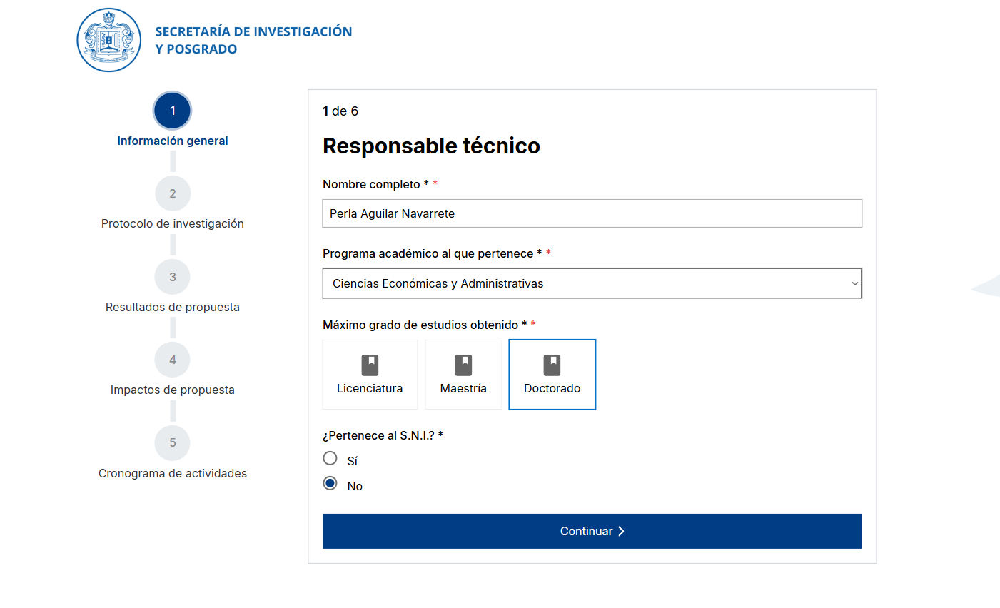
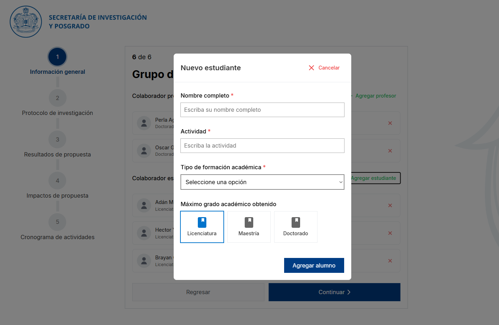
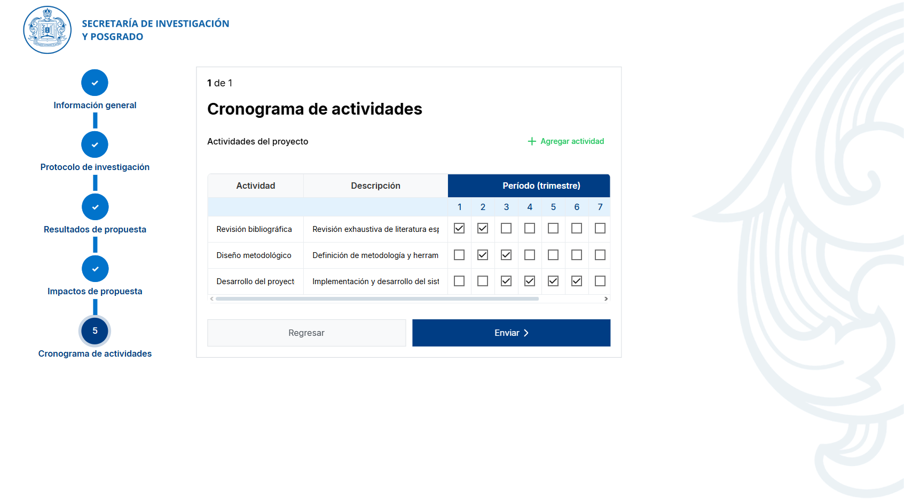
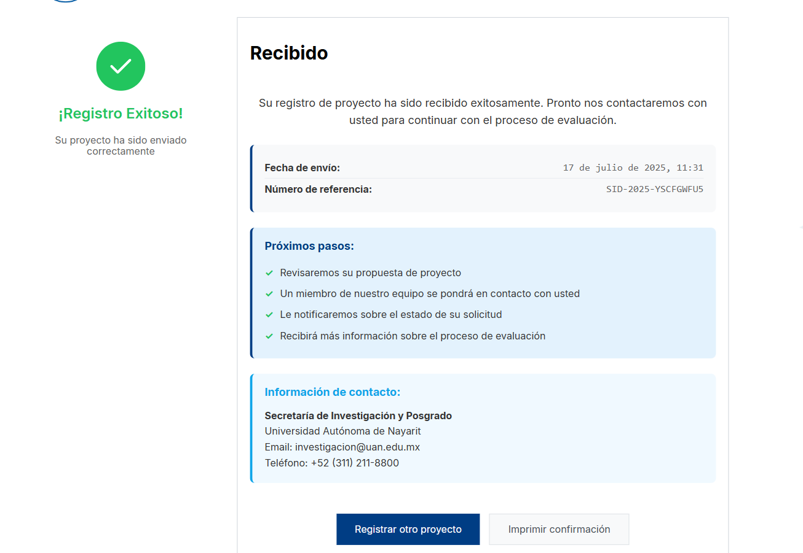

# SID - Sistema de Información y Desarrollo

Sistema web para el registro de proyectos de investigación y posgrado de la Secretaría de Investigación y Posgrado (SIP).

## 📋 Descripción

Este proyecto es una aplicación web desarrollada para facilitar el registro y gestión de proyectos de investigación académica. Permite a los investigadores registrar información detallada sobre sus proyectos, incluyendo información general, protocolos de investigación, resultados esperados, impactos y cronogramas de actividades.

## 🚀 Características

- **Formulario Multi-paso**: Interfaz intuitiva dividida en 6 pasos para una mejor experiencia de usuario
- **Validación en tiempo real**: Verificación de datos ingresados
- **Diseño responsivo**: Adaptable a diferentes dispositivos
- **Interfaz moderna**: Diseño limpio y profesional
- **Confirmación de registro**: Página de confirmación tras el envío exitoso

## 🛠️ Tecnologías Utilizadas

- **HTML5**: Estructura y contenido
- **CSS3**: Estilos y diseño responsivo
- **JavaScript**: Funcionalidad interactiva
- **SVG**: Iconografía vectorial

## 📸 Capturas de Pantalla

### Pantalla Principal


### Formulario de Registro - Paso 1


### Formulario de Registro - Paso 2


### Confirmación de Registro


## 📁 Estructura del Proyecto

```
sid/
├── index.html              # Página principal con formulario
├── confirmacion.html        # Página de confirmación
├── README.md               # Documentación del proyecto
├── css/
│   ├── reset.css          # Estilos de reset
│   └── style.css          # Estilos principales
├── images/
│   ├── favicon.ico        # Icono del sitio
│   ├── logo_sip.png       # Logo institucional
│   ├── membrete.svg       # Membrete
│   └── Screenshots/       # Capturas de pantalla
│       ├── 01.png
│       ├── 02.png
│       ├── 03.png
│       └── 04.png
└── js/
    └── main.js            # Lógica de la aplicación
```

## 🎯 Funcionalidades

### Formulario Multi-paso
1. **Información General**: Datos del responsable técnico y programa académico
2. **Protocolo de Investigación**: Detalles del proyecto de investigación
3. **Resultados de Propuesta**: Objetivos y resultados esperados
4. **Impactos de Propuesta**: Impacto esperado del proyecto
5. **Cronograma de Actividades**: Planificación temporal del proyecto

### Validaciones
- Campos obligatorios marcados con asterisco (*)
- Validación de longitud mínima y máxima
- Selección de opciones requeridas
- Verificación de formato de datos

## 🚀 Instalación y Uso

1. **Clonar el repositorio**:
   ```bash
   git clone https://github.com/brayort/sid.git
   ```

2. **Navegar al directorio**:
   ```bash
   cd sid
   ```

3. **Abrir en el navegador**:
   - Abrir `index.html` en su navegador web preferido
   - O utilizar un servidor local como Live Server

## 🎨 Personalización

### Colores y Estilos
Los estilos principales se encuentran en `css/style.css` y pueden ser modificados según las necesidades institucionales.

### Logo e Imágenes
- Reemplazar `images/logo_sip.png` con el logo institucional
- Actualizar `images/favicon.ico` con el favicon deseado

## 📱 Compatibilidad

- ✅ Chrome 60+
- ✅ Firefox 55+
- ✅ Safari 11+
- ✅ Edge 16+
- ✅ Dispositivos móviles (responsive design)

## 👥 Autores

- **Desarrollador Principal**: [brayort](https://github.com/brayort)
- **Desarrollador Principal**: [hectoruwo](https://github.com/HectorUwO)

## 📞 Contacto

Para soporte técnico o consultas sobre el proyecto, contactar a [Perla Aguilar Navarrete](https://www.linkedin.com/in/perla-aguilar-184ab4181/).

---

**© 2025 Unidad Academica de Economia. Todos los derechos reservados.**

*Este sistema ha sido desarrollado para facilitar la gestión de proyectos de investigación académica y mejorar los procesos administrativos de la institución.*
